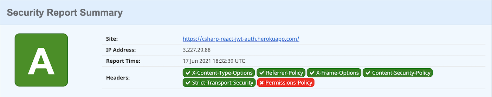
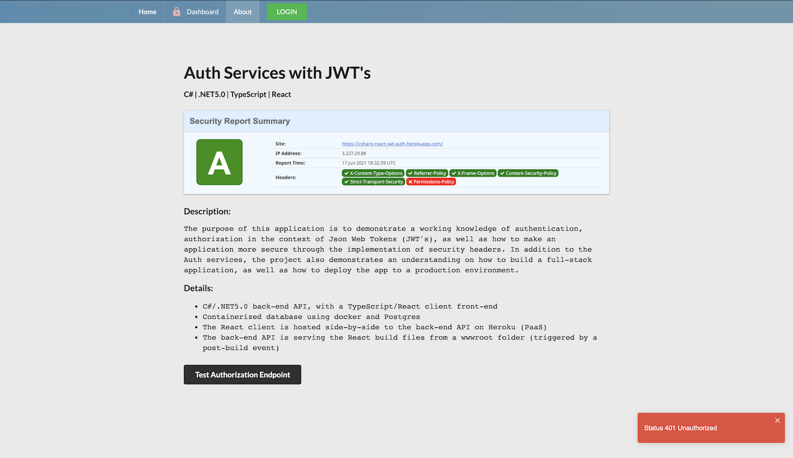

## Auth Services with JWT's
#### GitHub Repo: [csharp-react-jwt-auth](https://github.com/ratta2ii/csharp-react-jwt-auth)
#### Website: [Live Demo Here](https://csharp-react-jwt-auth.herokuapp.com/)

## Security Report "A" Rating
#### [securityheaders.com](https://securityheaders.com)

###### Landing Page

###### About App

###### Login

###### Dashboard/Profile

## Description
_The purpose of this application is to demonstrate a working knowledge of
authentication, authorization in the context of Json Web Tokens (JWT's),
as well as how to make an application more secure through the
implementation of security headers. In addition to the Auth services,
the project also demonstrates an understanding on how to build, and then
deploy, a full-stack application to production._

##  Details
- C#/.NET5.0 back-end API, with a TypeScript/React client front-end
- Containerized database using docker and Postgres
- The React client is hosted side-by-side to the back-end API on Heroku
(PaaS)
- The back-end API is serving the React build files from a wwwroot
          folder (triggered by a post-build event)
  
<!-- ## Installation (local machine)
    1. git clone https://github.com/ratta2ii/csharp-react-jwt-auth.git
    2. cd csharp-react-jwt-auth
    3. dotnet restore
    4. dotnet build
    5. cd API/
    6. dotnet watch run -->

## Languages | Frameworks | Technologies
1. C#/.NET5.0
2. JavaScript/TypeScript
3. React Library
4. Docker (container)
5. Postgres (relational database management system)
6. Heroku (PaaS)
7. Microsoft Identity (IdP)
8. Entity Framework Core
9. MobX (global state management)
10. Semantic-UI, Material-UI (icons)
11. HTML & CSS
12. react-toastify

## Licensing

The MIT License (MIT)

Copyright (c) 2021 Trevor Mackin
